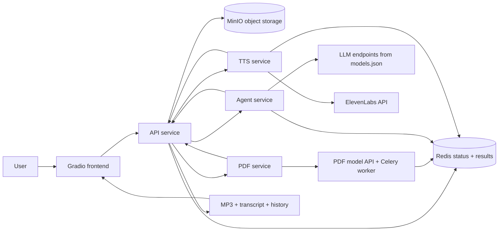

<div align="center">


# NVIDIA AI Blueprint: PDF to Podcast

Turn PDFs into narrated podcast audio with a local microservice pipeline, NVIDIA-hosted LLM endpoints, and ElevenLabs text-to-speech.


[Overview](#overview) · [System Flow](#system-flow) · [Quick Start](#quick-start) · [Pipelines](#application-pipelines) · [Repo Map](#repository-map) · [Accuracy Notes](#notes-on-accuracy)

</div>

---

## Overview

PDF to Podcast is a multi-service reference app that converts one or more PDF documents into podcast-ready audio.

| Area | What it does |
| --- | --- |
| Input | Target PDF, optional context PDFs, optional generation guidance |
| Processing | PDF extraction → transcript generation → TTS audio generation |
| Output | MP3 audio, transcript JSON, prompt/history artifacts |
| Runtime | Docker Compose services plus a local Gradio frontend |
| State | Redis for status/results, MinIO for durable files |
| Model config | `models.json` for NVIDIA-compatible LLM endpoints |

The default local flow uses NVIDIA-hosted API endpoints for LLM inference and ElevenLabs for speech generation. The service boundaries are explicit so PDF extraction, agent generation, and TTS can be adapted independently.

---

## System Flow



| Service | Port | Role |
| --- | ---: | --- |
| Frontend | auto, starts near `7860` | Upload PDFs, configure run, download outputs |
| API service | auto, starts near `8002` | Orchestrates the end-to-end job |
| PDF service | auto, starts near `8003` | Converts PDFs into markdown/content |
| PDF API | auto, starts near `8004` | Async PDF conversion backend |
| Agent service | auto, starts near `8964` | Generates monologue or dialogue transcript |
| TTS service | auto, starts near `8889` | Generates MP3 audio |
| Redis | auto, starts near `6379` | Job state, pub/sub, temporary results |
| MinIO | auto, starts near `9000` / `9001` | Object storage and console |
| Jaeger | auto, starts near `16686` | Trace UI |

`setup.sh` detects free host ports and writes the selected map to `.auto-ports.env`.

---

## Quick Start

### 1. Requirements

| Requirement | Notes |
| --- | --- |
| Docker Desktop / Docker Compose | Required for backend services |
| Bash | Git Bash, WSL, Linux bash, or compatible shell |
| Python env tooling | `setup.sh` installs `uv` if missing |
| API keys | NVIDIA + ElevenLabs |

Create `.env` in the repo root:

```env
NVIDIA_API_KEY=your_key
ELEVENLABS_API_KEY=your_key
MAX_CONCURRENT_REQUESTS=1
```

### 2. Start everything

Windows PowerShell:

```powershell
bash ./setup.sh --up
```

Linux / bash:

```bash
chmod +x setup.sh
./setup.sh --up
```

The script prints the actual service URLs after startup. The frontend usually starts near:

```text
http://localhost:7860
```

### 3. Stop or reset

```bash
bash ./setup.sh --down
bash ./setup.sh --clean
```

| Command | Effect |
| --- | --- |
| `--up` | Create/reuse venv, install deps if changed, allocate ports, build/start services, start frontend |
| `--down` | Stop frontend and Docker services |
| `--clean` | Stop everything, remove Docker volumes, remove local runtime artifacts and `.venv` |

---

## Application Pipelines

### End-to-end podcast generation

| Stage | Component | Result |
| --- | --- | --- |
| Upload | `frontend/` | Sends target/context PDFs to API |
| Job orchestration | `services/APIService/` | Creates `job_id`, stores files, tracks status |
| PDF extraction | `services/PDFService/` | Converts PDFs to markdown/content |
| Transcript generation | `services/AgentService/` | Produces dialogue or monologue JSON |
| Speech synthesis | `services/TTSService/` | Produces MP3 segments/final audio |
| Delivery | API + frontend | Exposes MP3, transcript, history |

### Transcript modes

| Mode | Source files | Behavior |
| --- | --- | --- |
| Dialogue | `services/AgentService/podcast_flow.py`, `podcast_prompts.py` | Two-speaker podcast-style conversation |
| Monologue | `services/AgentService/monologue_flow.py`, `monologue_prompts.py` | Single-speaker narration |

### Configuration surfaces

| File / variable | Purpose |
| --- | --- |
| `.env` | API keys and runtime env for Docker Compose |
| `models.json` | LLM names and API base URLs for reasoning/json/iteration roles |
| `docker-compose.yaml` | Service graph, ports, volumes, env wiring |
| `.auto-ports.compose.yaml` | Generated host-port override file |
| `.auto-ports.env` | Generated selected-port map |

---

## Deployment Profiles

| Profile | Description | Best for |
| --- | --- | --- |
| Local Compose | `setup.sh --up` starts backend services in Docker and frontend locally | Development, demos, source exploration |
| NVIDIA-hosted inference | Default `models.json` points at NVIDIA API-compatible endpoints | Fast setup without local LLM hosting |
| Self-hosted NIM | Update `models.json` and deployment config to point at local endpoints | Private infrastructure, custom latency/cost/GPU profile |
| AI Workbench | Separate Workbench path exists under `workbench/` | NVIDIA AI Workbench users |

This README focuses on the local Compose path because it matches the current `setup.sh` lifecycle.

---

## Repository Map

| Path | Purpose |
| --- | --- |
| `setup.sh` | One-command local lifecycle: up/down/clean |
| `docker-compose.yaml` | Service topology for Redis, MinIO, API, PDF, Agent, TTS, Jaeger |
| `models.json` | Model endpoint config consumed by Agent service |
| `frontend/` | Gradio UI and local frontend entrypoint |
| `services/APIService/` | API gateway and orchestration layer |
| `services/PDFService/` | PDF conversion service and model API worker |
| `services/AgentService/` | LLM transcript generation flows and prompts |
| `services/TTSService/` | ElevenLabs TTS service |
| `shared/shared/` | Shared job status, storage, types, telemetry helpers |
| `tests/` | Test and smoke-test entrypoints |
| `workbench/` | NVIDIA AI Workbench-specific instructions |

---

## Docs Index

| Doc | Use it for |
| --- | --- |
| `pdf-to-podcast-explanation.md` | Vietnamese source-code explanation and operating guide |
| `services/AgentService/README.md` | Agent service behavior and API |
| `services/PDFService/README.md` | PDF service behavior |
| `services/TTSService/README.md` | TTS service behavior |
| `workbench/README.md` | AI Workbench setup path |

---

## Operations

### Docker logs

```bash
docker compose -f docker-compose.yaml -f .auto-ports.compose.yaml --env-file .env logs -f
```

Service-specific logs:

```bash
docker compose -f docker-compose.yaml -f .auto-ports.compose.yaml --env-file .env logs -f api-service
docker compose -f docker-compose.yaml -f .auto-ports.compose.yaml --env-file .env logs -f pdf-service
docker compose -f docker-compose.yaml -f .auto-ports.compose.yaml --env-file .env logs -f agent-service
docker compose -f docker-compose.yaml -f .auto-ports.compose.yaml --env-file .env logs -f tts-service
```

Frontend log:

```powershell
Get-Content .\frontend\output.log -Wait
```

```bash
tail -f frontend/output.log
```

---

## Customization

| Goal | Where to change |
| --- | --- |
| Change LLM model or endpoint | `models.json` |
| Change podcast prompting | `services/AgentService/*_prompts.py` |
| Change dialogue/monologue flow | `services/AgentService/*_flow.py` |
| Change default TTS behavior | `services/TTSService/main.py` |
| Change UI | `frontend/__main__.py` |
| Use a separate PDF model service | `MODEL_API_URL` in `.env` / Compose env |

`MODEL_CONFIG_PATH` is set inside `docker-compose.yaml` to `/app/config/models.json`, with the repo `models.json` mounted into the Agent service container.

---

## Notes On Accuracy

- This README describes the current local Docker Compose + `setup.sh` flow.
- Host ports are not fixed when using `setup.sh`; read `.auto-ports.env` or the script output.
- `variables.env` is not the main config source for the `setup.sh --up` path.
- HTTP local endpoints are for development/demo use, not hardened production exposure.
- Features not visible in source or Compose config are intentionally not claimed here.
